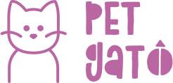

# PetGatô - Backend 🍁



Backend da aplicação do PetGatô, feita em Rails 🛤.

O gerenciamento desse projeto é feito no [Trello](https://trello.com/b/E6fkDLDG/petgat%C3%B4-grupo-2-2020-01)

- Versão do Ruby: `2.6.0`

## Começando

```
git clone https://gitlab.com/petgato-grupo-2/backend/
cd backend
bundle install
yarn install
rails db:create db:migrate
rails s
```

## Contribuindo

### Mensagens de commit:

```
# <tipo>: (Se aplicado esse commit...) <resumo> [50 caracteres]

# Explique o porquê do commit (opicional) [72 caracteres por linha]

# Deixe links para qualuer conteúdo relevante (artigos, card do trello)

# --- Fim do Commit ---
# Tipo pode ser um de
#   feat      ⭐
#   fix       🔧
#   tarefa    ⚙
#   estilo    💄
#   refactor  ♻
#   docs      📝
# --------
```

### Nomeação de branches

```
{tipo: feat | fix | tarefa}/{resumo: ~2-3 palavras}
```

### Merge Requests

Selecione o template padrão na maioria dos casos:

```
## O que esse merge faz

- Implementa essa feature
- Melhora a implementação daquela interface
- Altera o estilo desses componentes

## Card relacionado

link para o card no trello
```

## Selo SÓ TEM BRABO de qualidade 😎.
